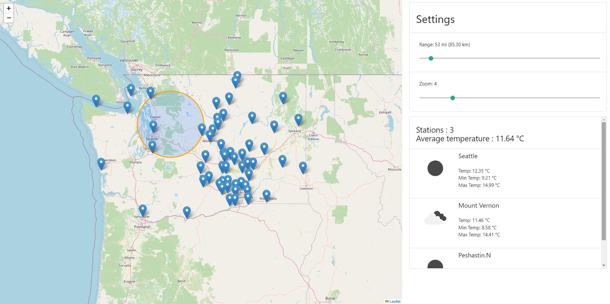

# Weather Stations

Weather Stations is a sample project that demonstrates the integration of Laravel, Docker, and Vue.js to build a weather station application. The project allows users to view weather data from various stations within a specified radius, providing real-time weather information in a user-friendly map interface.

**Local Access through Web Browsers:**

You can access the Weather Stations application locally through your web browser. Once the Docker containers are running, you can use the following URLs:

- **Laravel API**: `https://api.weather.local`
- **Vue.js SPA**: `https://weather.local`

For local access, ensure that you have added the required entries to your system's hosts file. Refer to the installation for instructions on how to configure your hosts file.

**SSL Certificates:**

Please note that for secure access (via HTTPS), you'll need to set up valid SSL certificates for `https://api.weather.local/` and `https://weather.local/`. Refer to the installation for more details on configuring SSL certificates.

## Prerequisites

Before you get started, ensure that you have the following software installed on your system:

- [Docker](https://www.docker.com/get-started)
## Getting Started

Follow these steps to set up and run the project locally:

1. Clone the repository:

   ```bash
   git clone https://github.com/usmykyta/weather-stations.git
   cd weather-stations
   ```
2. Run the setup script for your operating system:

   For Linux and Unix:
   ```bash
   ./setup.sh
   ```
   For Windows (Command Prompt):
   ```bash
   ./setup.bat
   ```

### Generating AccuWeather API Key

1. Sign up for an account on the AccuWeather Developer Portal: [https://developer.accuweather.com/](https://developer.accuweather.com/).

2. Once registered and logged in, navigate to the **My Apps** page to create a new app and obtain your API key.

3. Copy the generated API key, as you will need it in the next step.

### Adding the API Key to .env File

1. In the root directory of your Laravel project, locate the `.env.example` file.

2. Rename `.env.example` to `.env`:

   ```bash
   mv .env.example .env
   ``` 
3. Open the .env file in a text editor.
4. Look for the line that says `OPEN_WEATHER_APP_ID=`.
5. Save and close the .env file.

## Usage

1. Access the Laravel application by navigating to `https://weather.local` in your web browser.

2. On the main page, you will see the map displaying weather stations within a certain radius.

3. To change the radius of the weather stations, use the "Settings" section on the right side of the page. The "Range" slider allows you to adjust the radius in miles or kilometers. The "Zoom" slider lets you control the zoom level of the map.

4. Click on the map to select a new center location for the weather station search radius.

5. The list of weather stations within the selected radius will be displayed in the "Stations" section below the map. The list shows the station name, temperature, minimum temperature, and maximum temperature.

6. If there are no weather stations within the selected radius, a message indicating "No available stations within the radius" will be displayed.

7. The "Average temperature" section shows the average temperature of the weather stations within the selected radius. This value is displayed in Celsius (°C).

8. The weather information is automatically updated every 5 minutes using Supervisor.

## Preview


## License

This project is licensed under the [MIT License](LICENSE).
